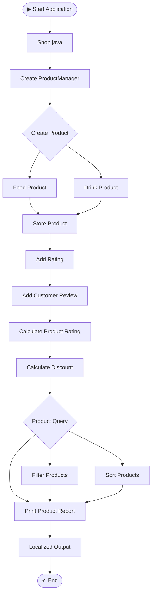
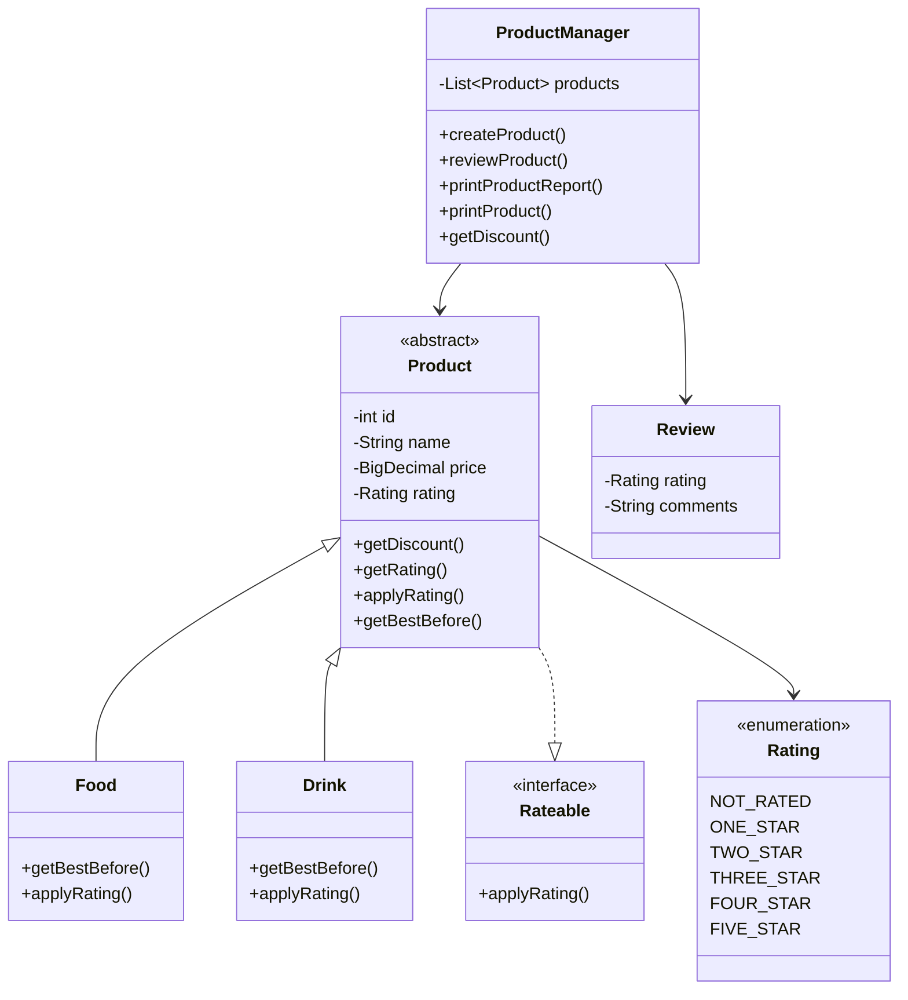

# 🛍️ Java Product Management System

<p align="center">
  
  
  
  
</p>

<p align="center">
  <b>A console-based Product Management System built with modern Java.</b>
  <br>
  Manage products, ratings, reviews, pricing, discounts, filtering, sorting and localization through a clean object-oriented architecture.
</p>

<p align="center">
  ⭐ <b>Modern Java</b> &nbsp; • &nbsp;
  🧩 <b>OOP</b> &nbsp; • &nbsp;
  ⚡ <b>Streams & Lambdas</b> &nbsp; • &nbsp;
  🌍 <b>Localization</b>
</p>

---

## 📌 About The Project

**Java Product Management System** is a console-based application designed to demonstrate how modern Java features can be combined to build a structured product management system.

The application allows products to be created and managed while supporting:

* ⭐ Product ratings and customer reviews
* 💰 Product pricing and discounts
* 📊 Automatic rating calculation
* 🔎 Product filtering
* ↕️ Product sorting
* 🧩 Product-specific behavior
* 🌍 Multi-language localization
* ⚠️ Custom exception handling
* 📝 Logging and resource management

The project focuses on applying Java concepts in a practical scenario rather than implementing them as isolated examples.

---

# 🚀 Features

| Feature                | Description                                           |
| ---------------------- | ----------------------------------------------------- |
| 🛍️ Product Management | Create and manage different types of products         |
| 🍔 Food Products       | Supports food-specific product behavior               |
| ☕ Drink Products       | Supports drink-specific product behavior              |
| ⭐ Rating System        | Products can receive ratings from 1–5 stars           |
| 💬 Reviews             | Customers can submit reviews for products             |
| 📊 Rating Calculation  | Product ratings are calculated from submitted reviews |
| 💰 Discounts           | Products support discount calculations                |
| 🔎 Filtering           | Filter products using functional predicates           |
| ↕️ Sorting             | Sort products using custom comparators                |
| 🌍 Localization        | Supports multiple languages and locales               |
| ⚠️ Exception Handling  | Custom product management exceptions                  |
| 💵 BigDecimal          | Accurate monetary calculations                        |
| 🧩 Modern Java         | Uses Records, Sealed Classes, Streams and Lambdas     |

---

# 🧠 Java Concepts Demonstrated

This project was developed to apply important **Core and Modern Java concepts** in a practical application.

### 🏗️ Object-Oriented Programming

* Encapsulation
* Inheritance
* Abstraction
* Polymorphism
* Method overriding
* Interfaces

### 🔐 Modern Java Features

* Sealed Classes
* Pattern Matching with `instanceof`
* Records
* Lambda Expressions
* Functional Interfaces
* Stream API
* Generics
* Method References
* `Optional` / collection processing concepts

### 📦 Java APIs

* `java.util`
* `java.time`
* `java.math.BigDecimal`
* `java.util.function`
* `java.util.stream`
* `java.util.logging`
* `java.util.Locale`
* Resource Bundles

---

# 🏛️ Project Architecture

The application follows a simple layered structure separating the **application**, **domain/data**, and **localization resources**.

```text
ProductManagement
│
├── src
│   └── labs
│       └── pm
│           │
│           ├── app
│           │   └── Shop.java
│           │
│           └── data
│               ├── Product.java
│               ├── ProductManager.java
│               ├── Food.java
│               ├── Drink.java
│               ├── Rating.java
│               ├── Review.java
│               ├── Rateable.java
│               ├── ProductManagerException.java
│               │
│               ├── resources.properties
│               ├── resources_fr_FR.properties
│               ├── resources_ml_IN.properties
│               ├── resources_ru_RU.properties
│               └── resources_zh_CN.properties
│
└── README.md
```

---

# 🔄 Application Flow



---

# 🧩 Class Relationship



---

# 🔁 Core Business Flow

### 1️⃣ Product Creation

```text
        ┌─────────────────┐
        │ Create Product  │
        └────────┬────────┘
                 ↓
       ┌────────────────────┐
       │ Product Properties │
       │ ID                 │
       │ Name               │
       │ Price              │
       │ Rating             │
       └─────────┬──────────┘
                 ↓
        ┌─────────────────┐
        │ ProductManager  │
        └─────────────────┘
```

### 2️⃣ Review & Rating

```text
Customer
   │
   ▼
┌───────────────┐
│ Submit Review │
└───────┬───────┘
        │
        ▼
┌───────────────┐
│ Rating 1–5 ⭐ │
└───────┬───────┘
        │
        ▼
┌────────────────────┐
│ Update Product     │
│ Rating             │
└─────────┬──────────┘
          │
          ▼
┌────────────────────┐
│ Product Report     │
└────────────────────┘
```

---

# 💰 Discount Calculation

The base `Product` class uses `BigDecimal` for monetary calculations.

```java
public static final BigDecimal DISCOUNT_RATE =
        BigDecimal.valueOf(0.1);

public BigDecimal getDiscount() {
    return price
            .multiply(DISCOUNT_RATE)
            .setScale(2, HALF_UP);
}
```

Using `BigDecimal` avoids the precision problems commonly associated with floating-point arithmetic when working with money.

---

# ⚡ Streams, Lambdas & Functional Programming

Products can be filtered and sorted using Java's functional programming features.

Example:

```java
pm.printProduct(
    p -> p.getPrice().floatValue() < 2,
    (p1, p2) ->
        p2.getRating().ordinal()
        - p1.getRating().ordinal()
);
```

This demonstrates:

* Lambda Expressions
* `Predicate`
* `Comparator`
* Functional Programming
* Collection processing

---

# 🌍 Internationalization

The application supports localized resources using Java's **ResourceBundle** mechanism.

Currently included locales:

| Locale       | Language  |
| ------------ | --------- |
| 🇺🇸 Default | English   |
| 🇫🇷 `fr_FR` | French    |
| 🇮🇳 `ml_IN` | Malayalam |
| 🇷🇺 `ru_RU` | Russian   |
| 🇨🇳 `zh_CN` | Chinese   |

Example resource files:

```text
resources.properties
resources_fr_FR.properties
resources_ml_IN.properties
resources_ru_RU.properties
resources_zh_CN.properties
```

This makes the application easier to extend to additional languages.

---

# 🧱 Design Principles

The project applies several software engineering principles through its architecture.

### 🔹 Encapsulation

Product properties are kept private and accessed through methods.

### 🔹 Abstraction

`Product` provides common behavior while leaving product-specific behavior to subclasses.

### 🔹 Inheritance

```text
          Product
          /     \
         /       \
      Food      Drink
```

### 🔹 Polymorphism

Different product types can be handled through the common `Product` abstraction.

### 🔹 Interface-Based Design

The `Rateable` interface defines rating-related behavior.

### 🔹 Immutable Data

Java Records are used where appropriate for immutable data representation.

---

# 🛠️ Technologies

<p align="center">


</p>

---

# 📂 Important Classes

### `Product.java`

Abstract base class representing a product.

Responsible for:

* Product identity
* Name
* Price
* Rating
* Discount calculation
* Common product behavior

---

### `Food.java`

Represents food products and provides food-specific behavior such as best-before handling.

---

### `Drink.java`

Represents drink products and extends the common product model.

---

### `ProductManager.java`

The main business/service component responsible for:

* Product creation
* Product lookup
* Reviews
* Rating updates
* Product reports
* Filtering
* Sorting
* Discount information

---

### `Rating.java`

Enumeration representing product ratings:

```text
NOT_RATED
ONE_STAR ⭐
TWO_STAR ⭐⭐
THREE_STAR ⭐⭐⭐
FOUR_STAR ⭐⭐⭐⭐
FIVE_STAR ⭐⭐⭐⭐⭐
```

---

### `Review.java`

Represents customer feedback associated with a product rating.

---

### `Rateable.java`

Defines the contract for objects that support rating functionality.

---

### `Shop.java`

Application entry point demonstrating the complete product management workflow.

---

# ▶️ Getting Started

## Prerequisites

Make sure you have:

* Java JDK 17 or later
* IntelliJ IDEA / Eclipse / VS Code
* Git

Check your Java version:

```bash
java -version
```

---

# 📥 Installation

Clone the repository:

```bash
git clone https://github.com/YOUR_USERNAME/Java-Product-Management-System.git
```

Navigate into the project:

```bash
cd Java-Product-Management-System
```

Open the project in your preferred Java IDE.

---

# ▶️ Running the Application

Run:

```text
src/labs/pm/app/Shop.java
```

The `main()` method demonstrates:

```text
Create Products
      ↓
Add Reviews
      ↓
Calculate Ratings
      ↓
Calculate Discounts
      ↓
Generate Reports
      ↓
Filter Products
      ↓
Sort Products
      ↓
Display Localized Output
```

---

# 📊 Example Workflow

```text
╔══════════════════════════════════════╗
║       PRODUCT MANAGEMENT SYSTEM      ║
╚══════════════════════════════════════╝

🛍️ Product: Tea
💰 Price: $1.99
⭐ Rating: ⭐⭐⭐⭐
💬 Reviews: 6
🏷️ Discount: 10%

──────────────────────────────────────

🛍️ Product: Coffee
💰 Price: $1.99
⭐ Rating: ⭐⭐⭐
💬 Reviews: 3
🏷️ Discount: 10%

──────────────────────────────────────

🛍️ Product: Cake
💰 Price: $3.99
⭐ Rating: ⭐⭐⭐⭐⭐
💬 Reviews: 3
🏷️ Discount: 10%
```

> **Note:** The exact console output may vary depending on the current date and product data configured in `Shop.java`.

---

# 📈 Project Learning Outcomes

Through this project, the following concepts are practiced in an integrated application:

```text
                    JAVA
                      │
          ┌───────────┴───────────┐
          ▼                       ▼
         OOP               Modern Java
          │                       │
    ┌─────┼─────┐          ┌──────┼──────┐
    ▼     ▼     ▼          ▼      ▼      ▼
Inheritance  Abstraction  Streams Lambdas Generics
    │
    ▼
Polymorphism
    │
    ▼
Product Management
    │
 ┌──┴───────────────┐
 ▼                  ▼
Ratings          Discounts
 │                  │
 ▼                  ▼
Reviews          BigDecimal
 │
 ▼
Localization
```

---

# 🔮 Future Improvements

Potential improvements for the project include:

* [ ] Add a database using MySQL/PostgreSQL
* [ ] Add a REST API using Spring Boot
* [ ] Add user authentication and authorization
* [ ] Add a web-based frontend
* [ ] Add automated unit and integration tests
* [ ] Add product search functionality
* [ ] Add inventory management
* [ ] Add shopping cart functionality
* [ ] Add order management
* [ ] Add Docker support
* [ ] Add CI/CD using GitHub Actions

---

# 🧪 Possible Testing Strategy

Future automated tests could cover:

```text
Product Creation
      │
      ├── Valid Product
      ├── Invalid Product
      └── Duplicate Product
             │
             ▼
       Rating System
             │
      ┌──────┼──────┐
      ▼      ▼      ▼
   1 Star  3 Star  5 Star
      │      │      │
      └──────┼──────┘
             ▼
       Discount Logic
             │
             ▼
      Product Filtering
             │
             ▼
       Product Sorting
```

---

# 📚 Project Purpose

This project was created as a practical way to strengthen **Java programming and object-oriented design skills** by building a small but structured real-world application.

Rather than focusing only on individual Java syntax examples, the project combines multiple concepts into one cohesive system.

---

# 👨‍💻 Author

**Kush Pathak**

B.Tech Student | Java Developer | Backend Development Enthusiast

---

# ⭐ Support

If you found this project useful or are learning Java from it, consider giving the repository a ⭐.

---

<p align="center">
  <b>Built with ☕ Java & ❤️ for learning</b>
</p>

<p align="center">
  
</p>
